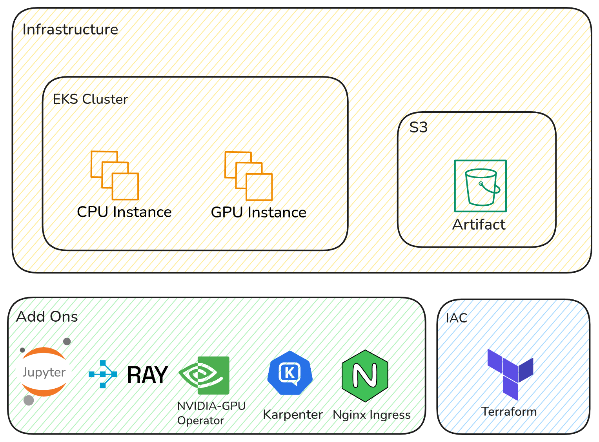

# AWS Community ID Demo

## Description

This repository contains the Infrastructure as Code (IaC) for building a Cost-Optimized, Multi-Tenant Machine Learning Platform on Amazon EKS, leveraging Karpenter for intelligent autoscaling and Ray for distributed workload orchestration.

The core goal is to demonstrate Resource Isolation (ensuring tenants do not overuse shared GPU/CPU resources) and GPU-Aware Scheduling at a minimal operational cost.

**🔴Disclamer🔴**

This demo focuses primarily on infrastructure and architectural design, not on model development or fine-tuning of AI/LLM workloads.

Model training & optimization examples may be added later in future update 😀

## Requirements

Before starting the deployment, ensure you have:

- AWS Account: With AdministratorAccess IAM permissions (for demo only).

- AWS Service Quota: Approved for at least 8 vCPUs for G and VT instances (critical for g4dn.xlarge).

- AWS CLI, kubectl, helm, and Terraform (>= 1.0) installed and configured.

- AWS Credentials: Configured locally via `aws configure`.

**Architecture**



| Component         | Description                                                                  |
| ----------------- | ---------------------------------------------------------------------------- |
| **JupyterHub**    | Multi-tenant web platform for launching isolated notebook servers per user, with Native Auth for built-in user authentication and session management                                |
| **Ray**           | Distributed computing engine for scaling ML workloads across nodes (CPU/GPU) |
| **Karpenter**     | Dynamic node autoscaler for AWS EKS                                          |
| **NVIDIA Plugin** | Enables GPU workloads on GPU-based EC2 nodes                                 |
| **Terraform**     | Infrastructure as Code to provision EKS, networking, and Helm releases       |

## Deployment Guide

Create an S3 bucket for Terraform state::

```sh
make create-bucket
```

Navigate to [infra/terraform](./infra/terraform/). Update [providers.tf](./infra/terraform/versions.tf) first, Make sure to configure your S3 backend properly for storing Terraform state:

```tf
# Store ".tfstate"  
backend "s3" {
    bucket = "<BUCKET_NAME" 
    key    = "terraform.tfstate"
    region = "<YOUR_BEST_REGION>" 
  }
```

Before running Terraform commands, update the following variable with your own IAM User ARN in [infra/terraform/terraform.tfvars](./infra/terraform/terraform.tfvars):

```tf
console_admin_arn = "arn:aws:iam::<YOUR_ACCOUNT_ID>:user/<YOUR_USERNAME>"
```

then run `terraform` commmands. Make sure everything runs correctly:

```sh
$ terraform init
$ terraaform plan
$ terrafrom apply
```

| Node Group            | Instance Type | Purpose                               |
| --------------------- | ------------- | ------------------------------------- |
| **head-group**        | `m5.large`    | Control plane + JupyterHub + Ray Head |
| **gpu-workers-group** | `g4dn.xlarge` | GPU-based workloads for Ray Workers   |

NB: You can adjust these instance types in main.tf based on your AWS quota and cost preference.
